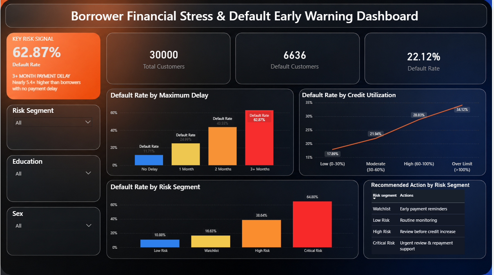

# Borrower Financial Stress & Default Early-Warning System

## Project Overview

This project analyses borrower payment behaviour to identify early warning signals of loan default.

The goal is not only to calculate default rates, but to answer a practical lending question:

> Which borrower behaviours provide strong and statistically reliable signs of financial stress?

The project combines data cleaning, feature engineering, exploratory analysis, statistical testing, risk segmentation and an interactive Power BI dashboard.

## Dashboard Preview



## Dataset

* Source: UCI Default of Credit Card Clients dataset
* Customers: 30,000
* Observation period: Six months of billing and payment behaviour
* Target: Default in the following month
* Overall default rate: 22.12%

## Tools Used

* Python
* Pandas and NumPy
* Matplotlib and Seaborn
* SciPy and Statsmodels
* Power BI
* DAX
* Google Colab

## Project Workflow

1. Data understanding and validation
2. Data cleaning
3. Feature engineering
4. Exploratory data analysis
5. Statistical testing
6. Logistic regression
7. Risk segmentation
8. Business recommendations
9. Power BI dashboard development

## Features Created

Important borrower-level features include:

* Average six-month credit utilization
* Early and recent utilization averages
* Utilization change
* Number of months showing payment delay
* Maximum payment delay
* Early and recent delay averages
* Number of zero-payment months despite having a bill
* Risk segment
* Recommended business action

## Key Findings

### Payment delay is the strongest warning signal

Default rate increased sharply with maximum payment delay:

* No delay: 11.71%
* One-month delay: 24.99%
* Two-month delay: 43.55%
* Three or more months: 62.87%

Borrowers with a three-or-more-month delay had approximately 5.4 times the default rate of borrowers with no delay.

### Repeated delays also indicate higher risk

Default rate increased from 11.71% among borrowers with no delayed months to 70.32% among borrowers showing delays in all six months.

### Higher credit utilization is associated with higher default risk

* Low utilization: 17.89%
* Moderate utilization: 21.94%
* High utilization: 28.83%
* Over the credit limit: 34.12%

## Statistical Evidence

### Chi-Square Test

* Chi-square statistic: 4327.60
* P-value: < 0.001
* Cramér’s V: 0.38

The results show a statistically significant and practically meaningful relationship between payment delay and default.

### Logistic Regression

After analysing multiple warning signals together:

* Each additional month showing delay increased default odds by approximately 38%.
* Each additional month in the maximum delay increased default odds by approximately 47%.
* A ten-percentage-point increase in utilization had a small but statistically significant effect.
* Zero payment despite having a bill was not independently significant after controlling for other variables.

Variance Inflation Factor values remained below 5, indicating no serious multicollinearity problem.

## Risk Segmentation

| Risk Segment  | Customers | Default Rate |
| ------------- | --------: | -----------: |
| Low Risk      |    14,610 |       10.88% |
| Watchlist     |     6,700 |       16.63% |
| High Risk     |     6,494 |       38.64% |
| Critical Risk |     2,196 |       64.80% |

The Critical Risk segment had nearly six times the default rate of the Low Risk segment.

## Recommended Actions

| Risk Segment  | Recommended Action                        |
| ------------- | ----------------------------------------- |
| Low Risk      | Routine monitoring                        |
| Watchlist     | Early payment reminders                   |
| High Risk     | Customer review before increasing credit  |
| Critical Risk | Urgent human review and repayment support |

These recommendations are designed to support human decisions rather than automatically reject or penalize borrowers.

## Project Structure

```text
slice-credit-risk-analysis/
├── Data/
│   └── credit_risk_final_dataset.csv
├── notebooks/
│   └── 01_credit_risk_data_analysis.ipynb
├── dashboard/
│   └── credit-risk-early-warning-dashboard.pbix
├── images/
│   └── credit-risk-dashboard.png
└── README.md
```

## Limitations

* The dataset is historical and may not represent present-day lending behaviour.
* The analysis identifies associations, not direct causation.
* Risk-segment rules are an educational prototype and require validation before real-world use.
* A real lender should also consider income, employment, economic conditions and responsible-lending requirements.

## Disclaimer

This is an independent educational portfolio project based on a public dataset. It is not affiliated with, approved by or based on internal data from Slice or any other financial institution.
